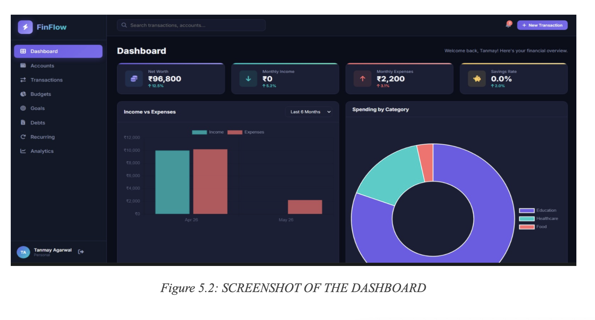
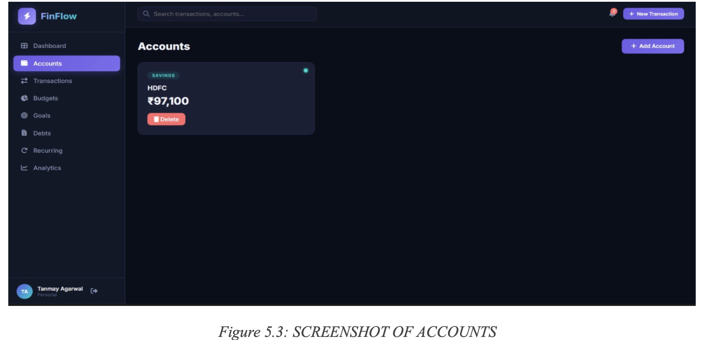
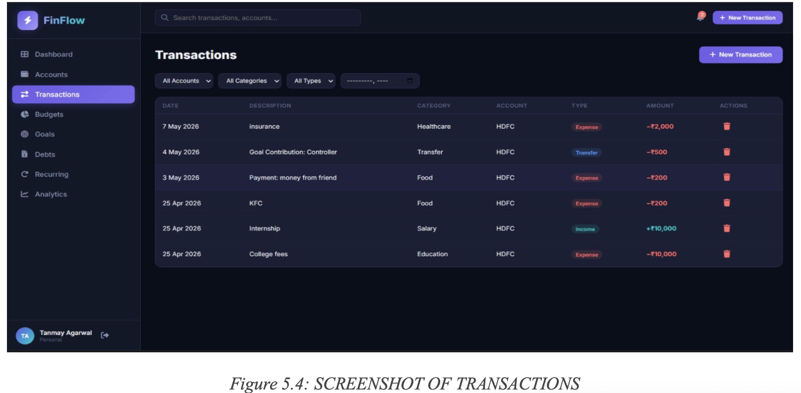
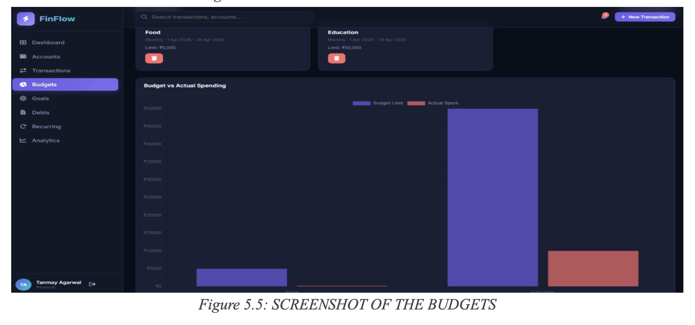
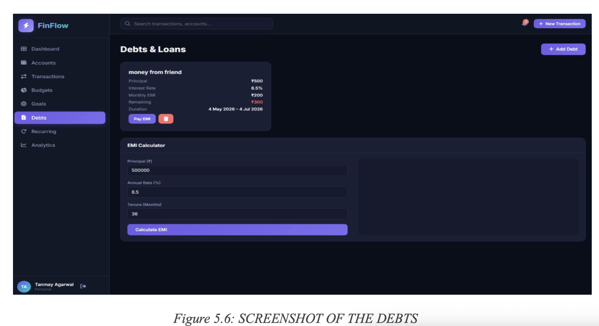
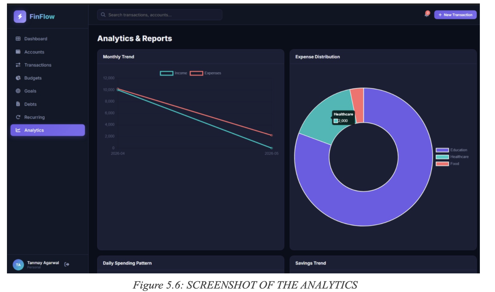

# FinFlow – Personal Finance Management System

## Overview

FinFlow is a full-stack personal finance management platform developed as a DBMS project. It enables users to manage accounts, track transactions, monitor budgets, manage debts, and analyze spending patterns through a centralized financial dashboard.

## Features

- User Authentication
- Account Management
- Income & Expense Tracking
- Budget Monitoring
- Savings Goals
- Debt & EMI Management
- Analytics Dashboard
- Financial Reporting

## Tech Stack

### Frontend
- HTML
- CSS
- JavaScript

### Backend
- Node.js
- Express.js

### Database
- SQLite
- SQL

## Database Concepts Used

- ER Modeling
- Relational Schema Design
- Normalization (1NF, 2NF, 3NF)
- SQL Queries & Joins
- Stored Procedures
- Triggers
- Transaction Management

## Installation

```bash
npm install
npm start
```

## Documentation

Project report available in:

docs/FinFlow_Project_Report.pdf

## Screenshots

### Dashboard



### Accounts



### Transactions



### Budgets



### Debts



### Analytics


